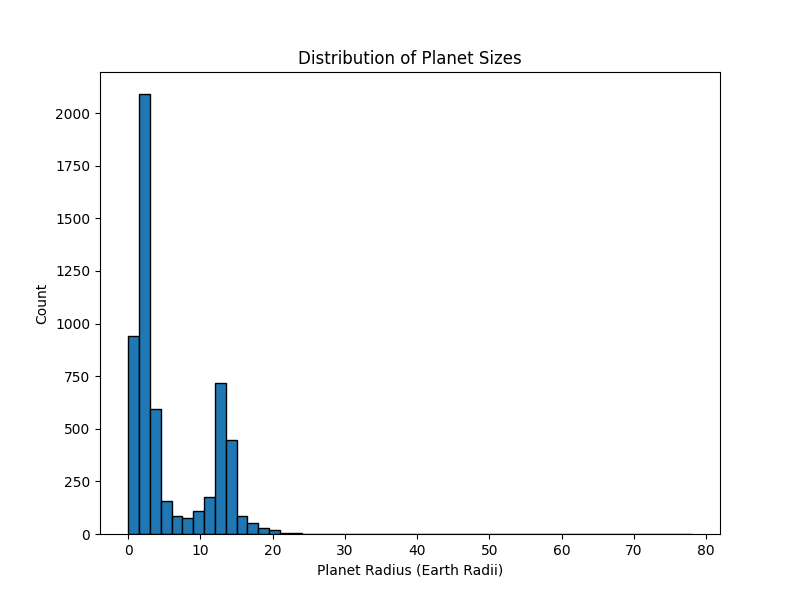
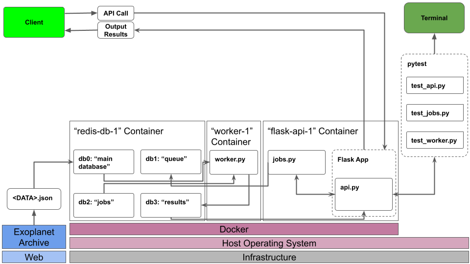

# Planetary Systems Final Project

## Overview
This Flask-based web application interfaces with the NASA Exoplanet Archive, allowing users to fetch and store exoplanet data in a Redis database, retrieve it based on various criteria, and visualize planet size distributions through asynchronous job submissions. Additionally, users can query information about host stars and discovery facilities associated with the exoplanet data. The application provides a RESTful API documentation endpoint for easy reference to available functionalities. It is deployed using Kubernetes for scalability and reliability.

## Contents
- `Dockerfile`: Defines the Docker container setup for the Flask application.
- `diagram.png`: A diagram depicting
- `README.md`: Provides information on how to use and deploy the API.
- `docker-compose.yml`: Automates the deployment of the Flask app and Redis containers.
- `requirements.txt`: Lists the required Python libraries to be installed in the container.
- `Makefile`: Lists the required Python libraries to be installed in the container.
- `src\api.py`: The main Flask application script for fetching, caching, and interacting with HGNC gene data.
- `src\jobs.py`: Contains functions for managing and processing jobs.
- `src\worker.py`: A script that runs the worker process for executing jobs.
- `test\test_api.py`: A pytest integration test to verify all aspects of api.py are functional.
- `test\test_jobs.py`: A pytest integration test to verify all aspects of jobs.py are functional.
- `test\test_worker.py`: A pytest integration test to verify all aspects of worker.py are functional.
- `kubernetes\prod\app-prod-deployment-flask.yml`:
- `kubernetes\prod\app-prod-deployment-redis.yml`:
- `kubernetes\prod\app-prod-deployment-worker.yml`:
- `kubernetes\prod\app-prod-ingress-flask.yml`:
- `kubernetes\prod\app-prod-pvc-redis.yml`:
- `kubernetes\prod\app-prod-service-flask.yml`:
- `kubernetes\prod\app-prod-service-nodeport-flask.yml`:
- `kubernetes\prod\app-prod-service-redis.yml`:
- `kubernetes\test\app-test-deployment-flask.yml`:
- `kubernetes\test\app-test-deployment-redis.yml`:
- `kubernetes\test\app-test-deployment-worker.yml`:
- `kubernetes\test\app-test-ingress-flask.yml`:
- `kubernetes\test\app-test-pvc-redis.yml`:
- `kubernetes\test\app-test-service-flask.yml`:
- `kubernetes\test\app-test-service-nodeport-flask.yml`:
- `kubernetes\test\app-test-service-redis.yml`:

## Getting Started
### Prerequisites
- Docker installed on host machine
- Internet connection

### Data Source
- The Planetary Systems data is sourced from the NASA Exoplanet archive: [Planetary Systems Dataset](https://exoplanetarchive.ipac.caltech.edu/cgi-bin/TblView/nph-tblView?app=ExoTbls&config=PSCompPars).
- This JSON file contains comprehensive information about planet's orbital period, planet mass, planet radius, discovery method, and various other physical and orbital characteristics. The dataset also provides information about the host stars of these exoplanets, such as their mass, radius, temperature, and luminosity.
- Dataset Citation: NASA Exoplanet Archive. NASA Exoplanet Science Institute. Retrieved from https://exoplanetarchive.ipac.caltech.edu/cgi-bin/TblView/nph-tblView?app=ExoTbls&config=PSCompPars

### Running the Containerized App
- Navigate to the directory containing the Dockerfile & docker-compose.yml.
- Build and deploy the Flask app and Redis containers: 
    - `docker-compose up --build -d`
    - This command builds the Docker images based on the Dockerfile and starts the containers, deploying the Flask app and worker in separate containers. Another container is created for the Redis database.

### Running the Integration Tests
- Navigate to the same directory containing the Dockerfile & docker-compose.yml.
- Run the following command to run the integration tests (this may take up to two minutes):
    - `pytest -v`

## API Examples & Result Interpretation

### Exoplanet Data Endpoints
The application provides several API endpoints to access different subsets of the Planetary Systems data. Below is a description of each endpoint and how to use them:

### Load Data

```python
# Request:
curl -X POST http://localhost:5000/data
```
```python
# Expected Output:
{
  "message": "Data loaded into Redis",
  "status": "success"
}
```


### Get All Data

```python
# Request:
curl -X GET http://localhost:5000/data
```
```python
# Expected Output:
...
,{
    "decstr": "-00d34m37.60s",
    "disc_facility": "European Space Agency (ESA) Gaia Satellite",
    "disc_year": 2022,
    "discoverymethod": "Transit",
    "hostname": "Gaia-1",
    "pl_bmasse": 533.95172,
    "pl_name": "Gaia-1 b",
    "pl_orbeccen": null,
    "pl_orbper": 3.052524,
    "pl_orbsmax": 0.04047,
    "pl_rade": 13.776,
    "rastr": "06h02m34.48s",
    "st_logg": 4.44,
    "st_mass": 0.95,
    "st_met": null,
    "st_rad": 0.95,
    "st_spectype": null,
    "st_teff": 5470.0,
    "sy_dist": 363.66,
    "sy_gaiamag": 12.9988,
    "sy_kmag": 11.269,
    "sy_pnum": 1,
    "sy_snum": 1,
    "sy_vmag": 13.242
  },
  ...

```
- This route will return the entire dataset in JSON format.


### Delete All Data

```python
# Request:
curl -X DELETE http://localhost:5000/data
```
```python
# Expected Output:
{
  "message": "Data deleted from Redis",
  "status": "success"
}
```


### Retrieve Exoplanets based on Query Parameters.

```python
# Request:
curl -X GET http://localhost:5000/exoplanets?min_radius=1.5&max_radius=2.5
```
```python
# Query Parameters:
'''
min_radius (float): The minimum radius value in Earth radii.
max_radius (float): The maximum radius value in Earth radii.
method (str): The discovery method.
start_year (int): The start year for discovery.
end_year (int): The end year for discovery.
'''
```
```python
# Expected Output:
[ ...
  ,"Kepler-1272 b",
  "Kepler-204 c",
  "Kepler-1673 b",
  "WASP-95 b",
  "HD 126614 b",
  "Kepler-482 b",
  "HATS-45 b",
  "81 Cet b",
  "Kepler-883 b",
  "Kepler-164 e",
  "GJ 143 b",
  "K2-266 e",
  "HD 33142 c",
  "Kepler-1632 b",
  "HU Aqr AB c",
  "Kepler-363 d",
  "Kepler-829 b",
  "TOI-2081 b",
  "HATS-24 b",
  "Kepler-30 c",
  "HD 204941 b",
  "Kepler-100 d",
  ...
]
```
- Query Parameters:
  - min_radius (float): The minimum radius value in Earth radii.
  - max_radius (float): The maximum radius value in Earth radii.
  - method (str): The discovery method.
  - start_year (int): The start year for discovery.
  - end_year (int): The end year for discovery.

- Output will be filtered based on query parameters.
- Be sure to replace any spaces between the words within a discovery methods name with a "%20".


### Retrieve Exoplanet Data for a Specific Exoplanet from Redis.

```python
# Request:
curl -X GET http://localhost:5000/exoplanets/<pl_name>

curl -X GET http://localhost:5000/exoplanets/30%20Ari%20B%20b
```
```python
# Expected Output:
{
  "decstr": "+24d38m52.84s",
  "disc_facility": "Thueringer Landessternwarte Tautenburg",
  "disc_year": 2009,
  "discoverymethod": "Radial Velocity",
  "hostname": "30 Ari B",
  "pl_bmasse": 4392.4106,
  "pl_name": "30 Ari B b",
  "pl_orbeccen": 0.29,
  "pl_orbper": 335.10001,
  "pl_orbsmax": 0.99,
  "pl_rade": 12.3,
  "rastr": "02h36m57.91s",
  "st_logg": 4.43,
  "st_mass": 1.93,
  "st_met": 0.19,
  "st_rad": 1.41,
  "st_spectype": "F6 V",
  "st_teff": 6331.0,
  "sy_dist": 44.657,
  "sy_gaiamag": 6.96085,
  "sy_kmag": 5.822,
  "sy_pnum": 1,
  "sy_snum": 4,
  "sy_vmag": 7.09209
}
```
- Output will differ based on the inputted planet name.
- Be sure to replace any spaces between the words within a planet's name with a "%20", as shown above.


### Retrieve all unique Host Stars

```python
# Request:
curl -X GET http://localhost:5000/hosts
```
```python
# Expected Output:
[
  "Kepler-850",
  "HD 109988",
  "HD 171028",
  "Kepler-391",
  "Kepler-861",
  "GJ 3634",
  "Kepler-333",
  "WASP-25",
  "HAT-P-16",
  "Kepler-1924",
  "Kepler-534",
  "HD 25912",
  "Kepler-1034",
  "Kepler-1331",
  "Kepler-1872",
  "Kepler-693",
  "K2-287",
  "Kepler-645",
  "Kepler-1523",
  ...
]

```


### Retrieve all planets orbiting a specific Host Star

```python
# Request:
curl -X GET http://localhost:5000/hosts/<hostname>

curl -X GET http://localhost:5000/hosts/18%20Del
```
```python
# Expected Output:
{
  "hostname": "18 Del",
  "num_planets": 1,
  "planets": [
    "18 Del b"
  ]
}
```
- Output will differ based on the inputted host name.
- Be sure to replace any spaces between the words within a hostname with a "%20", as shown above.


### Retrieve all unique Discovery Facilities

```python
# Request:
curl -X GET http://localhost:5000/facilities
```
```python
# Expected Output:
[
  "Leoncito Astronomical Complex",
  "Hubble Space Telescope",
  "XO",
  "Xinglong Station",
  "James Webb Space Telescope (JWST)",
  "CoRoT",
  "Multiple Observatories",
  "Transiting Exoplanet Survey Satellite (TESS)",
  "SuperWASP-South",
  "Lowell Observatory",
  "Haleakala Observatory",
  "KELT-South",
  "MOA",
  "Mauna Kea Observatory",
  "Thueringer Landessternwarte Tautenburg",
  ...
]
```


### Retrieve all planets discovered by a specific facility

```python
# Request:
curl -X GET http://localhost:5000/facilities/<facility_name>

curl -X GET http://localhost:5000/facilities/Hubble%20Space%20Telescope
```
```python
# Expected Output:
[
  "SWEEPS-4 b",
  "PSR B1620-26 b",
  "SWEEPS-11 b",
  "2MASS J04414489+2301513 b",
  "CFHTWIR-Oph 98 b",
  "CHXR 73 b"
]
```
- Output will differ based on the inputted facility name.
- Be sure to replace any spaces between the words within a facility with a "%20", as shown above.

### Get information about all endpoints
```python
# Request:
curl -X GET http://localhost:5000/help
```
```python
# Expected Output:
{
  "/data": {
    "doc": "Delete exoplanet data from Redis. Returns: tuple: A tuple containing the JSON response and HTTP status code.",
    "methods": "DELETE,OPTIONS"
  },
  "/exoplanets": {
    "doc": "Retrieve exoplanets based on query parameters. Query Parameters: min_radius (float): The minimum radius value in Earth radii. max_radius (float): The maximum radius value in Earth radii. method (str): The discovery method. start_year (int): The start year for discovery. end_year (int): The end year for discovery. Returns: tuple: A tuple containing the JSON response and HTTP status code.",
    "methods": "GET,OPTIONS,HEAD"
  },
  "/exoplanets/<pl_name>": {
    "doc": "Retrieve exoplanet data for a specific exoplanet host name from Redis. Args: pl_name (str): The name of the exoplanet. Returns: tuple: A tuple containing the JSON response and HTTP status code.",
    "methods": "GET,OPTIONS,HEAD"
  },
  ...
}
```

### Job Endpoints
The application provides several API endpoints to manage and process jobs. These endpoints allow you to submit new jobs, retrieve job IDs, and check the status of specific jobs. Below is a description of each job endpoint and how to use them:

### Submit Job
```python
# Request:
curl -X POST http://localhost:5000/jobs -H "Content-Type: application/json" -d '{"bin_size": 1.5}'
```
```python
# Expected Output:
[
  "id": "c69cb71c-47a9-4801-aed9-de725bd339e7", 
  "bin_size": 1.5,
  "status": "submitted"
]
```
- Required Parameters:
  - bin_size (float): The bin size used for the planetary size histogram.
- Submits a new job to plot a histogram of planetary sizes (radii) using the given bin size.

### Get All Job IDs
```python
# Request:
curl -X GET http://localhost:5000/jobs
```
```python
# Expected Output:
[
  "1d30b65d-e4fb-462a-a904-7d32d3bb9293",
  "8a054a82-1693-4b47-ad21-7342512f9548",
  "be6de1a0-5d8c-4aac-bcaa-1b8ed7b78845", 
  "a48f0a18-55f4-45d8-aa5f-482f1131a584",
  "c69cb71c-47a9-4801-aed9-de725bd339e7"
]
```
- Retrieves a list of all job IDs.

### Get Status of a Specific Job
```python
# Request:
curl -X GET http://localhost:5000/jobs/<jobid>

curl -X GET http://localhost:5000/jobs/1d30b65d-e4fb-462a-a904-7d32d3bb9293
```
```python
# Expected Output:
[
  "id": "1d30b65d-e4fb-462a-a904-7d32d3bb9293",
  "bin_size": 1.5,
  "status": "complete"
]
```
- Retrieves the status of a specific job.
- Replace <jobid> in the URL with the desired job ID.

### Get Results of a Specific Job
```python
# Request: 
curl -X GET -o histogram.png http://localhost:5000/results/<jobid>

curl -X GET -o histogram.png http://localhost:5000/results/1d30b65d-e4fb-462a-a904-7d32d3bb9293
```
#### Expected Output


- Retrieves the results of a specific job.
- Replace <jobid> in the URL with the desired job ID.
- The output will be a histogram plot saved with the name "histogram.png" to the local directory.

## Data Description
The link directs to the NASA Exoplanet Archive, a comprehensive database housing information on exoplanets—planets orbiting stars beyond our solar system. This dataset likely comprises a wealth of data regarding these distant worlds, including their names or designations, physical characteristics, and orbital properties. Each entry in the dataset corresponds to a specific exoplanet, with columns representing various attributes such as mass, radius, orbital period, temperature, and distance from their respective host stars. Users can navigate through the dataset using filters and search options provided by the Exoplanet Archive interface, enabling them to explore and analyze the diverse range of exoplanetary systems discovered by astronomers worldwide.

The key fields in the Planetary Systems data were retrieved from the NASA Exoplanet Archives website found [here](https://exoplanetarchive.ipac.caltech.edu/cgi-bin/TblView/nph-tblView?app=ExoTbls&config=PSCompPars) and are as follows:

- decstr: Declination of the host star in sexagesimal format.
- disc_facility: Facility responsible for discovering the exoplanet.
- disc_year: Year when the exoplanet was discovered.
- discoverymethod: Method used to discover the exoplanet.
- hostname: Name of the host star.
- pl_bmasse: Mass of the exoplanet relative to Earth's mass.
- pl_name: Name of the exoplanet.
- pl_orbeccen: Eccentricity of the exoplanet's orbit.
- pl_orbper: Orbital period of the exoplanet in days.
- pl_orbsmax: Semi-major axis of the exoplanet's orbit in astronomical units.
- pl_rade: Radius of the exoplanet in Earth radii.
- rastr: Right ascension of the host star in sexagesimal format.
- st_logg: Surface gravity of the host star in log10(cm/s^2).
- st_mass: Mass of the host star in solar masses.
- st_met: Metallicity of the host star.
- st_rad: Radius of the host star in solar radii.
- st_spectype: Spectral type of the host star.
- st_teff: Effective temperature of the host star in Kelvin.
- sy_dist: Distance to the planetary system in parsecs.
- sy_gaiamag: Gaia magnitude of the host star.
- sy_kmag: Ks (2MASS) magnitude of the host star.
- sy_pnum: Number of planets in the planetary system.
- sy_snum: Number of stars in the planetary system.
- sy_vmag: V (Johnson) magnitude of the host star.


## Software Architecture Diagram
- The software architecture diagram visualizes the Dockerized environment of the api.py Flask app running locally as well as the dockerized database and worker. Within the Docker containers, the Flask App is depicted as `api.py` running within the "flask-api-1" container. The communications between the various containers are denoted using arrows as well as the communications out of the containers to the client. The diagram also illustrates the integration tests managed by pytest running outside the docker container and the flow of data from the web to the database.

